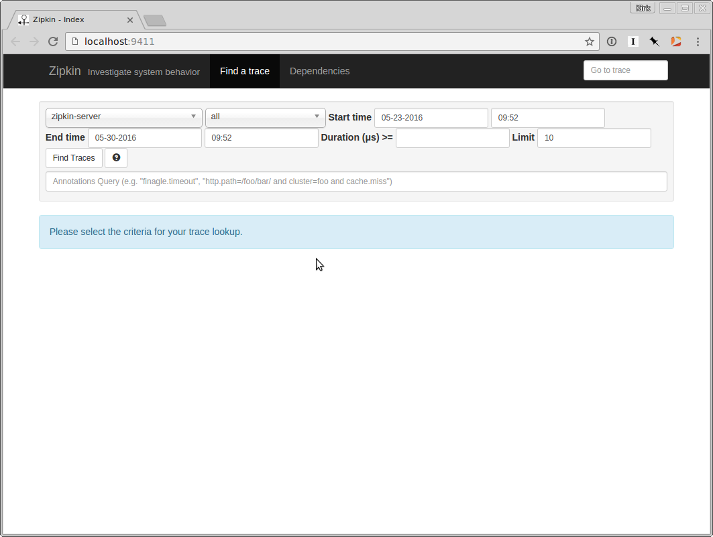
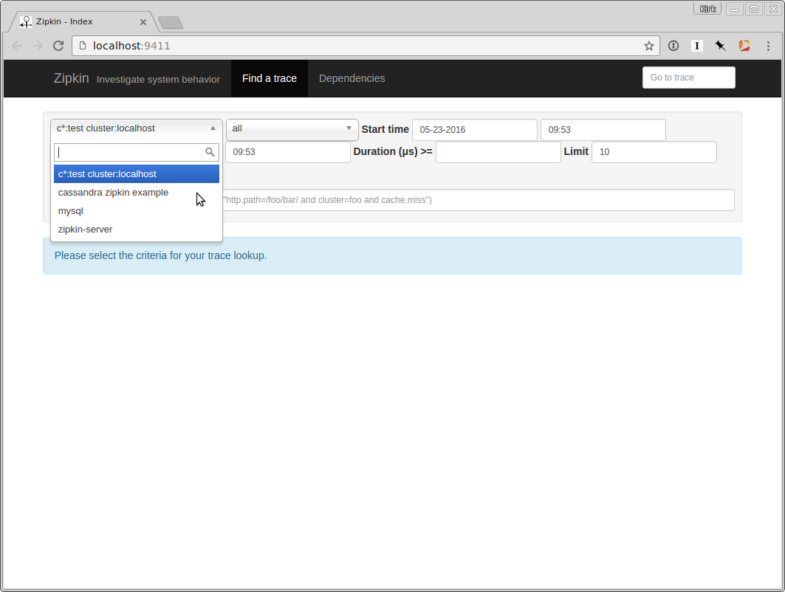
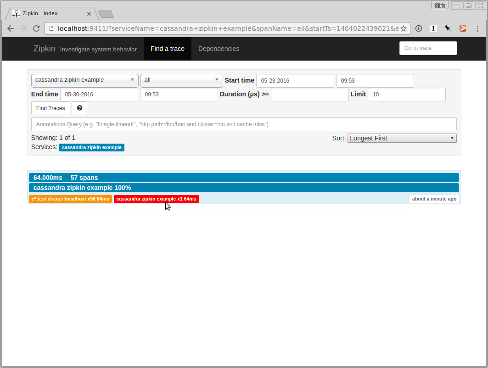
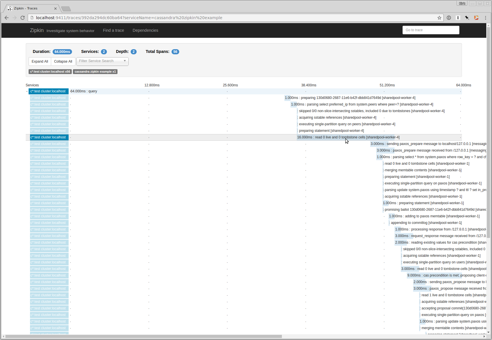
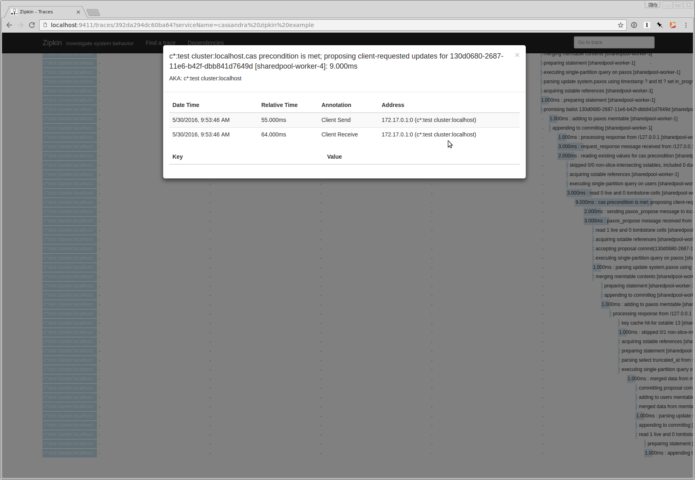

# cassandra-zipkin-example

Zipkin is a system for tracing, viewing, and troubleshooting distributed systems and microservice-based applications. Here's the description from the [Zipkin website](http://zipkin.io/):

> Zipkin is a distributed tracing system. It helps gather timing data needed to troubleshoot latency problems in microservice architectures. It manages both the collection and lookup of this data. Zipkin’s design is based on the Google Dapper paper.

You can learn more and follow development of the code via its [GitHub project page](https://github.com/openzipkin/zipkin).

# Set Up

We'll be creating several tabs/windows in which to run our example, one for
each of the following:

1. The [`cassandra-zipkin-example`](https://github.com/mustardgrain/cassandra-zipkin-example) repository
1. A single node [Cassandra](http://cassandra.apache.org) instance
1. The [`cassandra-zipkin-tracing`](https://github.com/thelastpickle/cassandra-zipkin-tracing) repository
1. The [Zipkin Server](https://github.com/openzipkin/docker-zipkin-java)

This example shows us managing a scratch workspace in the `/tmp` directory, but feel free to choose a different location. (Just update the steps appropriately.)

### Step 1: Clone `cassandra-zipkin-example`

Open a new tab/window to use for setting up the
`cassandra-zipkin-example` code.

```bash
cd /tmp
git clone git@github.com:mustardgrain/cassandra-zipkin-example.git
cd cassandra-zipkin-example
```

### Step 2: Install Cassandra

Open a new tab/window to download and manage our Cassandra instance.
You will need to install a version of Cassandra >= 3.4:

```bash
CASSANDRA_URL=http://archive.apache.org/dist/cassandra/3.4/apache-cassandra-3.4-bin.tar.gz
cd /tmp
curl $CASSANDRA_URL | tar xz
cd apache-cassandra-3.4
```

### Step 3: Clone `cassandra-zipkin-tracing`

Next, open a new tab/window in which to use for setting up the
`cassandra-zipkin-tracing` code.

Clone the `cassandra-zipkin-tracing` repo, build it, and install the
requisite libraries in Cassandra:

```bash
CASSANDRA_HOME=/tmp/apache-cassandra-3.4

cd /tmp
git clone git@github.com:thelastpickle/cassandra-zipkin-tracing.git
cd cassandra-zipkin-tracing

mvn -q clean package

cp lib/brave* $CASSANDRA_HOME/lib
cp target/cassandra-zipkin-tracing-* $CASSANDRA_HOME/lib

tracing_key=cassandra.custom_tracing_class
tracing_value=com.thelastpickle.cassandra.tracing.ZipkinTracing
handler_key=cassandra.custom_query_handler_class
handler_value=org.apache.cassandra.cql3.CustomPayloadMirroringQueryHandler

cat << EOF >> $CASSANDRA_HOME/conf/jvm.options
-D=$tracing_key=$tracing_value
-D=$handler_key=$handler_value
EOF
```

### Step 4: Start the Zipkin Server

Next, open a new tab/window in which to get the Zipkin Server running:

```bash
cd /tmp
git clone git@github.com:openzipkin/docker-zipkin-java.git
cd docker-zipkin-java
docker-compose up --force-recreate
```

It may take a minute or two to pull the Docker images down and start the containers.

Afterward, you'll see a message in the console:

> `Started ZipkinServer in 2.526 seconds (JVM running for 2.739)`

You're good to go to bring up the Zipkin UI in your browser: http://localhost:9411/

If all has gone well, your should see something like this:



### Step 5: Start Cassandra

Next, go to the tab/window in you installed Cassandra (from step 2) and
let's start Cassandra running:

```bash
./bin/cassandra -f
```

If everything was working, you should see this in your logs:

> `Using com.thelastpickle.cassandra.tracing.ZipkinTracing as tracing queries (as requested with -Dcassandra.custom_tracing_class)`

and:

> `Using org.apache.cassandra.cql3.CustomPayloadMirroringQueryHandler as query handler for native protocol queries (as requested with -Dcassandra.custom_query_handler_class)`

Those reflect the configuration changes we made in step 3.

### Step 6: Run the `cassandra-zipkin-example` Application

Next, go back to the original `cassandra-zipkin-example` tab/window
and create the sample schema, build the example application, and run it:

```bash
CASSANDRA_HOME=/tmp/apache-cassandra-3.4
CQL_FILE=src/main/resources/cassandra-schema.cql

cat $CQL_FILE | $CASSANDRA_HOME/bin/cqlsh

mvn -q clean package

java -jar target/cassandra-zipkin-example-1.0.0.jar
```

If all is well you will see this output:

> `Successfully inserted kirk@mustardgrain.com`

### Step 7: View the Traces in the Zipkin UI

Load (or refresh) the Zipkin UI in your browser (http://localhost:9411/) and you
should hopefully now see two new entries for `cassandra zipkin example` and
`c*:test cluster:localhost` in the service name drop down:



Select `cassandra zipkin example` from the service name drop down and then
click the "Find Traces" button. This will show the trace of our calls:



If you click on the call for our "cassandra zipkin example" you will see a
breakdown of the entire trace of where the time was spent in the Cassandra
call:



Finally, when you click on a specific step in the trace for our call, you
will see more detail:



# Parting Thoughts

Zipin is a powerful tool for tracking down where latency and performance
problems occur in your application. Being able to see both the high- and
low-level performance characteristics of your system will help to troubleshoot
and plan accordingly. Depending on the level of support in the systems you're
using, you can develop insight into the innards of these systems, which
is important from both a practical and academic standpoint.

Note that (Open)Zipkin is morphing into the [OpenTracing](http://opentracing.io/) project, so there's a little bit of confusion (at least on my part) about the current state of these projects. Regardless, there will no doubt be many useful tools that come out of these (and other related) projects.
